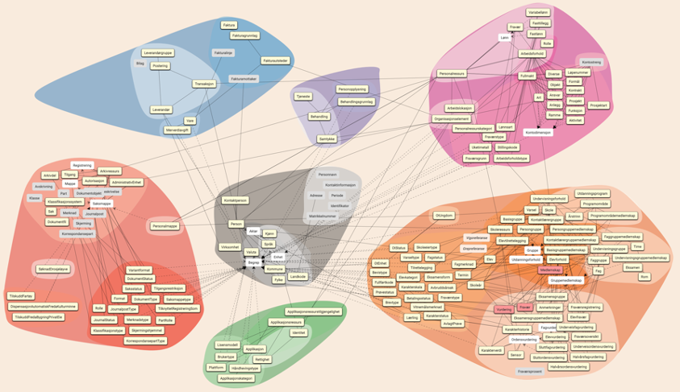
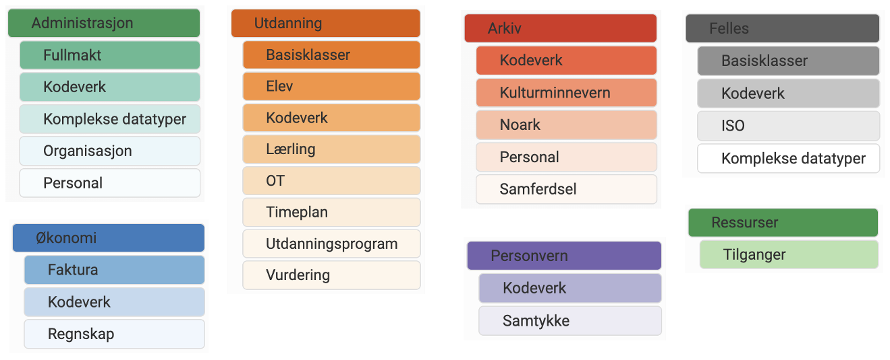
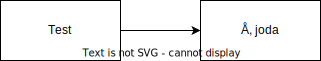
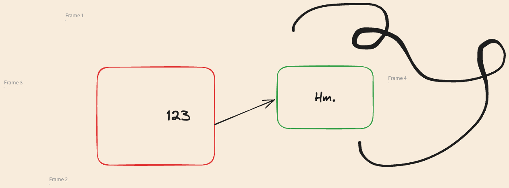

<!-- _class: forside-a -->
###### 12. nov 2024 / Ole Anders Eidjord
# FINT Informasjonsmodell 

---

# Agenda

1. Informasjonsmodellen
1. Kodeeksempel

---

###### INFORMASJONSMODELLEN

<!-- _footer: "[https://informasjonsmodellen.felleskomponent.no](https://informasjonsmodell.felleskomponent.no/)" -->

---

###### INFORMASJONSMODELLEN
# Inneholder


---

###### INFORMASJONSMODELLEN
# Hvordan vi jobber med informasjonsmodellen


---

###### INFORMASJONSMODELLEN
# Demo av excalidraw



---

###### INFORMASJONSMODELLEN

# Kodeeksempel 

```json
{
    "name": "John Doe",
    "age": 30,
    "city": "New York"
}
```

---

# Bilder og Diagrammer


---

# Lister og <br> Punkter

1. Første punkt
2. Andre punkt
   - Underpunkt A
   - Underpunkt B
3. Tredje punkt

---

<!-- _class: sisteside-a -->
<p>Deltabygget<br/>Kjølnes Ring 30,<br/>3918 Porsgrunn<br/><br/>novari.no</p>

# Takk for oppmerksomheten!
<!-- _footer: "Presentasjonen finnes på: [https://github.no/fintlabs/](https://github.no/fintlabs/)" -->